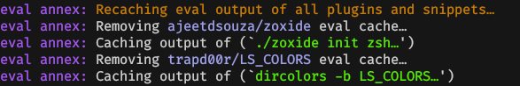

<table style="align:center;width:100%;height:auto"><tr><td align="center">
  <h1 align="center">
    <a href="https://github.com/z-shell/zi">
      
    </a>❮ ZI ❯ Annex - Eval
  </h1>
<h2>Allows to cache the output of arbitrarily slow initialization command to speed up shell startup time.
</h2>
    
  </td>
</tr>
</table>

Synopsis:

```shell
zi recache <plugin/snippet>
```

In order to enable tab completion for the new subcommand set the value `Z_A_USECOMP=1` somewhere **before** loading this plugin.

```shell
zi atinit'Z_A_USECOMP=1' light-mode for z-shell/z-a-eval
```

## 💡 Wiki

- [annexes](https://z.digitalclouds.dev/docs/ecosystem/annexes)

## Installation

Simply load like a regular plugin:

```shell
zi light z-shell/z-a-eval
```

After executing this command you can then use the new ice-mods provided by
the annex.

## How it works

The output of a slow initialization command is redirected to a file located within the plugin/snippets directory and sourced while loading. The next time the plugin/snippet is loaded, this file will be sourced skipping the need to run the initialization command.

The ice-modifier `eval''` provided and handled by this annex creates a `cache` in the plugin/snippets root directory which stores the commands output.

This cache is regenerated when:

- The plugin/snippet is updated.
- The cache file is removed.
- With the new ZI subcommand `recache`.

> The optional preceding `!` flag means to store command output regardless of exit code. Otherwise `eval''` will avoid caching ouput of code which returns a non-zero exit code.

## Example Invocations

### Without z-a-eval

```shell
zi ice as"command" from"gh-r" mv"zoxide* -> zoxide"  \
  atclone"./zoxide init zsh > init.zsh"  atpull"%atclone" src"init.zsh" nocompile'!'
zi light ajeetdsouza/zoxide
```

```shell
zi ice atclone"dircolors -b LS_COLORS > init.zsh" \
  atpull"%atclone" pick"init.zsh" nocompile'!' \
  atload'zstyle ":completion:*" list-colors “${(s.:.)LS_COLORS}”'
zi light trapd00r/LS_COLORS
```

### With z-a-eval

```shell
zi ice as"command" from"gh-r" mv"zoxide* -> zoxide" \
  eval"./zoxide init zsh"
zi light ajeetdsouza/zoxide
```

```shell
zi ice eval"dircolors -b LS_COLORS" \
  atload'zstyle ":completion:*" list-colors “${(s.:.)LS_COLORS}”'
zi light trapd00r/LS_COLORS
```

## Without ZI

```shell
if [[ "${+commands[kubectl]}" == 1 ]]; then
  eval $(kubectl completion zsh)
fi
```

## With ZI and z-a-eval

```shell
## Updated during `zi update`
zi ice id-as"kubectl_completion" has"kubectl" \
  eval"kubectl completion zsh" run-atpull
zi light z-shell/null
```

---

> This repository compatible with [ZI](https://github.com/z-shell/zi).

## Credits

Author: [NICHOLAS85](https://gihub.com/NICHOLAS85)
